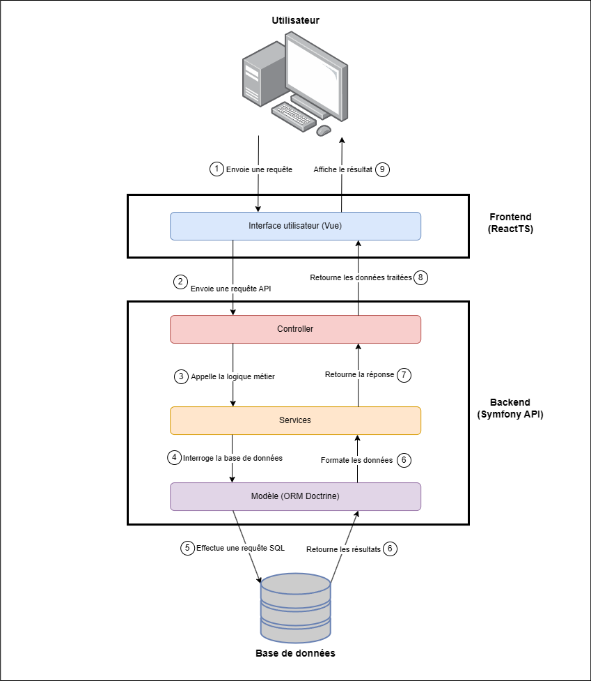

# 📐 Plan d'Architecture Technique – TaskBoard

## Sommaire
1. [Diagramme d’architecture](#-1-diagramme-darchitecture)
2. [Arborescence du projet](#-2-arborescence-du-projet)
3. [Authentification & sécurité](#-3-authentification--sécurité)
4. [Stratégie de test & environnements](#-4-stratégie-de-test--environnements)
5. [Déploiement & automatisation](#-5-déploiement--automatisation)

## 🧱 1. Diagramme d’architecture



---

## 📁 2. Arborescence du projet

```bash
.
├── app/
│    ├── backend/
│    │    ├── config/
│    │    └── src/
│    │        ├── Controller/
│    │        ├── Entity/
│    │        ├── Repository/
│    │        └── Service/
│    └── frontend/
│        ├── public/
│        └── src/
│            ├── components/
│            ├── pages/
│            ├── hooks/
│            └── services/
├── docker/
├── docs/
└── README.md
```

---

## 🔐 3. Authentification & sécurité

- Authentification via JWT (LexikJWTAuthenticationBundle)
- `/login` génère un token signé
- Le token JWT est stocké dans un cookie sécurisé (`HttpOnly`, `Secure`, `SameSite=Strict`)
- Un token CSRF est stocké dans le `localStorage` côté frontend
- Les requêtes protégées incluent automatiquement le cookie JWT
- Le frontend ajoute également un en-tête `X-CSRF-Token` dans chaque requête pour prévenir les attaques CSRF


### Routes publiques :
- POST `/login`
- POST `/register`

### Routes protégées :
- Toutes les routes `/tasks`, `/tags`, `/stats` → protégées par `ROLE_USER`
- Accès avancé (ex : suppression utilisateurs) pour `ROLE_ADMIN`

### Sécurité complémentaire :
- CORS configuré
- Possibilité de Rate Limiting
- Validation des données en entrée (DTO + assertions Symfony)

---

## 🧪 4. Stratégie de test & environnements

### Types de tests :
- ✅ **Unitaires** : sur services Symfony avec PHPUnit
- ✅ **Fonctionnels** : test des endpoints (WebTestCase)
- ✅ **End to end** : Cypress

### Environnements :
- `dev` : debug activé, hot reload
- `test` : BDD dédiée + fixtures
- `prod` : optimisé et sécurisé

### Gestion des configs :
- `.env`, `.env.local`, `.env.test`
- Variables d’environnement injectées depuis Docker ou CI

---

## 🚀 5. Déploiement & automatisation

### Services Docker :
- `backend` : Symfony + PHP + API Platform
- `frontend` : React + Vite
- `db` : MySQL


### Backend :
- Hébergé sur Render
- Déploiement auto depuis `main`
- Dockerisé

### Frontend :
- Hébergé sur Netlify ou Vercel
- Build auto depuis GitHub

### CI/CD :
- GitHub Actions :
  - Linter
  - Tests
  - Build
